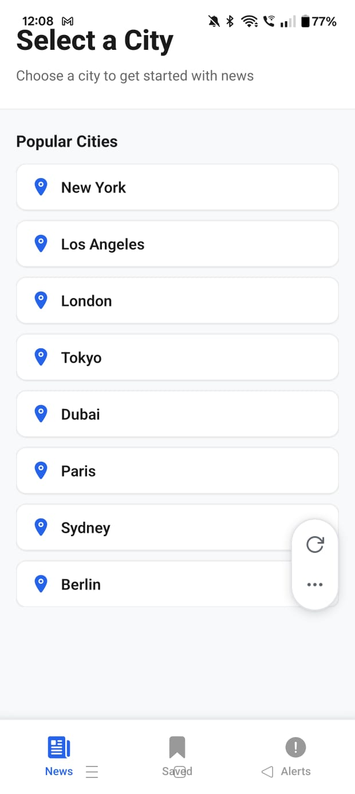
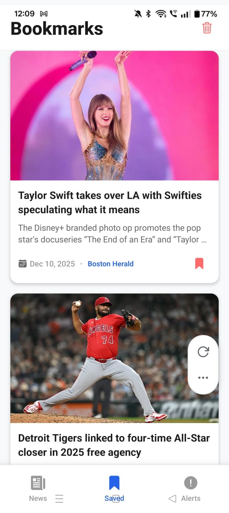
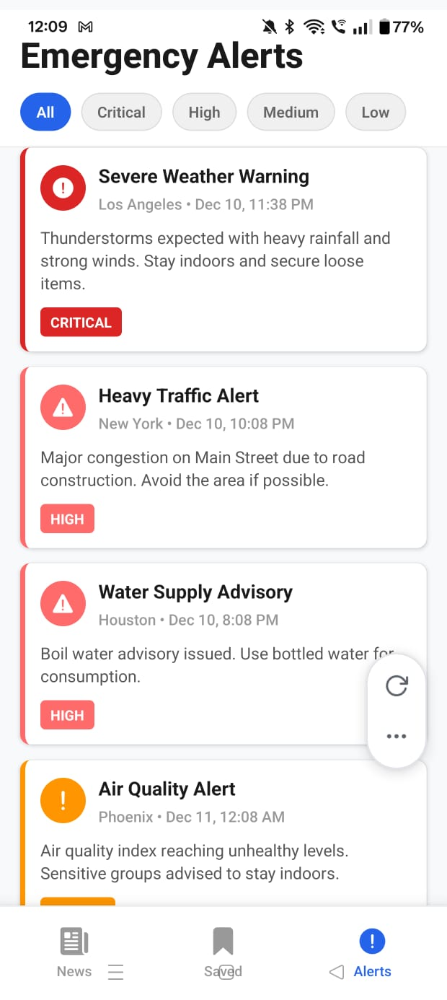
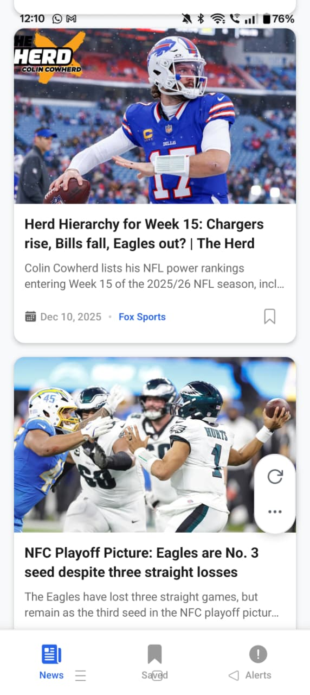
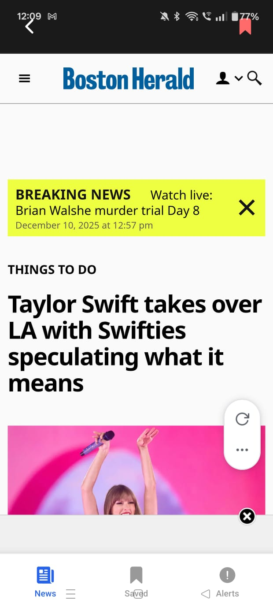

# 📰 City Pulse - Smart City News & Alerts

> A beautiful, modern React Native mobile app for getting real-time city-specific news and emergency alerts.


## 🎯 Overview

City Pulse is a comprehensive news app that helps users stay informed about what's happening in their city. Select any city worldwide and get curated news articles, browse emergency alerts, and bookmark your favorite stories for later reading.

### Key Features

- 🌍 **City-Based News** - Search news for any city in the world
- 📰 **Real-Time Articles** - Powered by NewsAPI.org with 30,000+ sources
- 📖 **In-App Reader** - Read full articles with WebView
- 🔖 **Smart Bookmarks** - Save articles with AsyncStorage persistence
- 🚨 **Emergency Alerts** - Color-coded alerts by severity level
- 🔄 **Pull-to-Refresh** - Get latest news with a swipe
- 📱 **Beautiful UI** - Modern, responsive mobile design
- ⚡ **Lightning Fast** - Optimized performance and smooth animations

## 📸 Screenshots & Layout

### App Review

**1. City Selector Screen**


**2. News Feed Screen**


**3. News WebView Screen**


**4. Bookmarks Screen**


**5. Emergency Alerts Screen**


### Screen Hierarchy

```
City Pulse App
├── Bottom Tab Navigation
│   ├── News Tab
│   │   ├── City Selector Screen
│   │   ├── News Feed Screen
│   │   │   └── News WebView Screen
│   │   └── Emergency Alerts Screen (accessible)
│   ├── Saved Tab
│   │   └── Bookmarks Screen
│   └── Alerts Tab
│       └── Emergency Alerts Screen
```

## 🚀 Quick Start

### Prerequisites

- Node.js 18+
- npm or yarn
- Expo CLI: `npm install -g expo-cli`

### Installation

```bash
# 1. Navigate to project
cd city-pulse

# 2. Install dependencies
npm install

# 3. Get API key from https://newsapi.org

# 4. Add API key to services/newsApi.ts
# Find line 5: const API_KEY = 'YOUR_NEWSAPI_KEY_HERE';
# Replace with your actual key

# 5. Start development server
npm start

# 6. Press 'a' for Android or 'i' for iOS
```

### First Time Setup Guide

See **QUICK_START.md** for detailed 5-minute setup guide.

## 📁 Project Structure

```
city-pulse/
├── App.tsx                          # Main app with bottom tabs
├── index.ts                         # App entry point
│
├── 📁 screens/                      # Main screens
│   ├── CitySelectorScreen.tsx       # Choose city
│   ├── NewsFeedScreen.tsx           # News list
│   ├── NewsWebViewScreen.tsx        # Read article
│   ├── BookmarksScreen.tsx          # Saved articles
│   └── EmergencyAlertsScreen.tsx    # Alerts
│
├── 📁 components/                   # Reusable UI
│   ├── NewsCard.tsx                 # Article card
│   ├── AlertCard.tsx                # Alert card
│   └── LoadingIndicator.tsx         # Spinner
│
├── 📁 hooks/                        # Custom React hooks
│   └── useBookmarks.ts              # Bookmark logic
│
├── 📁 services/                     # API integration
│   └── newsApi.ts                   # NewsAPI.org
│
├── 📁 types/                        # TypeScript types
│   └── types.ts                     # Interfaces
│
├── 📁 navigation/                   # Navigation setup
│   └── AppNavigator.tsx             # Stack navigator
│
└── 📄 Documentation/
    ├── README.md                    # This file
    ├── QUICK_START.md              # 5-min setup
    ├── SETUP_GUIDE.md              # Detailed docs
    ├── API_INTEGRATION_GUIDE.md     # API details
    ├── UI_DESIGN_SYSTEM.md          # Design specs
    └── PROJECT_COMPLETE.md          # Project summary
```

## 🎨 UI Components

### NewsCard

Beautiful article preview with:

- Large image
- Title & description
- Publication date & source
- Bookmark button
- Tap to read full article

### AlertCard

Emergency alert display with:

- Severity-coded border color
- Alert icon
- Title, city, timestamp
- Full description
- Severity badge

### LoadingIndicator

Simple loading state with spinning indicator.

## 🔧 Architecture

### State Management

- **React Hooks** - useState, useEffect
- **Custom Hooks** - useBookmarks for persistence

### Navigation

- **Bottom Tab Navigation** - News, Saved, Alerts
- **Stack Navigation** - City selector → News feed → WebView

### Storage

- **AsyncStorage** - Persistent bookmark storage
- **Local State** - UI state and temporary data

### API

- **NewsAPI.org** - Real-time news data
- **Axios** - HTTP client for API calls

## 📱 Screen Descriptions

### 1. City Selector Screen

**Purpose**: Select a city to view news

- 15 pre-loaded popular cities
- Search for custom cities
- Beautiful card UI
- One-tap selection

**Popular Cities**: New York, Los Angeles, London, Tokyo, Dubai, Paris, Sydney, Berlin, Toronto, Singapore, Bangkok, Mumbai, Mexico City, Moscow, Istanbul

### 2. News Feed Screen

**Purpose**: Display news articles for selected city

**Features**:

- Infinite scroll (pagination)
- Pull-to-refresh
- Article preview cards
- Bookmark functionality
- Change city button
- Loading states
- Error handling

**Article Display**: 20 articles per page, sorted by latest first

### 3. News WebView Screen

**Purpose**: Read full article content

**Features**:

- Native WebView rendering
- Back button
- Bookmark in header
- Dark navigation bar
- Smooth scrolling

### 4. Bookmarks Screen

**Purpose**: View saved articles

**Features**:

- All bookmarked articles
- Persistent storage (survives app close)
- Tap to read in WebView
- Remove individual bookmarks
- Clear all bookmarks
- Empty state UI

### 5. Emergency Alerts Screen

**Purpose**: Show emergency and important alerts

**Features**:

- Severity filtering (All, Critical, High, Medium, Low)
- Color-coded by severity
- Sorted by severity + timestamp
- 6 sample alerts included
- City and time information

**Severity Levels**:

- 🔴 Critical (Dark Red) - #DC2626
- 🟠 High (Bright Red) - #FF6B6B
- 🟡 Medium (Orange) - #FF9500
- ⚪ Low (Yellow) - #FFB800

## 💾 Data Models

### News Interface

```typescript
interface News {
  title: string; // Article title
  description: string; // Summary
  image: string; // Image URL
  url: string; // Article link
  date: string; // Formatted date
  source?: string; // News source
  content?: string; // Full text
}
```

### EmergencyAlert Interface

```typescript
interface EmergencyAlert {
  id: string;
  title: string;
  description: string;
  severity: "low" | "medium" | "high" | "critical";
  timestamp: string;
  city: string;
}
```

### Bookmark Interface

```typescript
interface Bookmark {
  id: string;
  news: News;
  bookmarkedAt: string;
}
```

## 📡 API Integration

### NewsAPI.org

- **Endpoint**: `https://newsapi.org/v2/everything`
- **Authentication**: API key query parameter
- **Rate Limit**: 50 requests/day (free tier)
- **Response**: JSON array of articles

### API Call Example

```typescript
// Fetch news for a city
const articles = await newsApi.fetchNewsByCity("New York", 1);

// Returns:
// [
//   {
//     title: "Breaking News...",
//     description: "...",
//     image: "...",
//     url: "...",
//     date: "Dec 10, 2024",
//     source: "BBC News"
//   }
// ]
```

### Getting an API Key

1. Visit https://newsapi.org/
2. Click "Get API Key"
3. Sign up (free tier available)
4. Copy key from dashboard
5. Add to `services/newsApi.ts`

## 🎨 Design System

### Color Palette

```
Primary Blue:   #2563EB  - Main brand color
Error Red:      #FF6B6B  - Bookmarks, alerts
Success Green:  #22C55E  - Success states
Warning Yellow: #FFB800  - Low severity
Info Orange:    #FF9500  - Medium severity
Critical Red:   #DC2626  - Critical severity
```

### Typography

- **H1**: 28px, 800 weight - Main headers
- **H2**: 24px, 800 weight - Screen titles
- **Body**: 16px, 600 weight - Main text
- **Label**: 14px, 500 weight - Subtitles
- **Caption**: 12px, 500 weight - Metadata

### Spacing

- **Extra Small**: 4px
- **Small**: 8px
- **Medium**: 12px
- **Regular**: 16px
- **Large**: 20px

## 🔄 Data Flow

```
User Opens App
    ↓
Load Bookmarks from AsyncStorage
    ↓
City Selector Screen
    ↓ (Select City)
News Feed Screen
    ├ Fetch News via NewsAPI
    ├ Display Articles
    └ User Actions:
        ├ Tap Article → WebView
        ├ Bookmark → AsyncStorage
        ├ Refresh → Fetch new data
        ├ Scroll → Load more (pagination)
        └ Tab Navigation → Saved/Alerts
```

## 📦 Dependencies

### Core

```json
{
  "react": "19.1.0",
  "react-native": "0.81.5",
  "expo": "~54.0.27"
}
```

### Navigation

```json
{
  "@react-navigation/native": "^7.1.25",
  "@react-navigation/native-stack": "^7.8.6",
  "@react-navigation/bottom-tabs": "^7.2.1",
  "react-native-screens": "~4.16.0",
  "react-native-safe-area-context": "~5.6.0"
}
```

### UI & Icons

```json
{
  "@expo/vector-icons": "^14.0.0",
  "react-native-webview": "^13.16.0"
}
```

### Data & Storage

```json
{
  "axios": "^1.13.2",
  "@react-native-async-storage/async-storage": "^1.23.1"
}
```

### Development

```json
{
  "typescript": "~5.9.2",
  "@types/react": "~19.1.0"
}
```

## 🎓 How It Works

### 1. App Initialization

- App starts and loads bookmarks from storage
- Displays city selector screen
- Prepares navigation stack

### 2. City Selection

- User taps a city or searches custom
- Selected city stored in component state
- News feed fetches articles for that city

### 3. News Fetching

- NewsAPI endpoint called with city name
- Up to 20 articles returned per page
- Articles displayed in FlatList
- Images lazy-loaded

### 4. Reading Articles

- User taps article card
- WebView screen opens with article URL
- Full article loads in native WebView
- Back button returns to feed

### 5. Bookmarking

- User taps bookmark icon
- Article saved to AsyncStorage
- Bookmark list updated
- Heart icon changes to filled state

### 6. Bookmark Persistence

- Bookmarks stored as JSON in AsyncStorage
- Persist across app sessions
- Load on app start via useBookmarks hook
- Deletable individually or all at once

## 🐛 Error Handling

### Network Errors

```typescript
// App handles:
- Connection timeouts
- Failed API requests
- Invalid JSON responses
- Shows user-friendly alerts
```

## ✨ Features Implemented

### Core Features

- ✅ City selection from 15 popular cities
- ✅ Real-time news fetching from NewsAPI
- ✅ Article display in beautiful cards
- ✅ WebView for reading full articles
- ✅ Bookmark system with AsyncStorage
- ✅ Persistent bookmarks across sessions
- ✅ Emergency alerts with 6 hardcoded alerts
- ✅ Severity-based alert filtering
- ✅ Color-coded alert display
- ✅ Pull-to-refresh functionality
- ✅ Infinite scroll with pagination
- ✅ Error handling and alerts
- ✅ Loading states
- ✅ Empty state UI
- ✅ Beautiful bottom tab navigation

### User Interface

- ✅ Modern, responsive design
- ✅ Consistent color scheme
- ✅ Smooth animations
- ✅ Accessible touch targets
- ✅ Loading indicators
- ✅ Error messages
- ✅ Empty states

### Key Libraries

- **Axios** - HTTP client
- **AsyncStorage** - Local persistence
- **WebView** - Native web rendering
- **React Navigation** - App navigation
- **Expo Icons** - Icon library

### Getting Help

- Check documentation files
- Review code comments
- Test with sample data
- Check console for errors

---

## 🎉 Ready to Use!

Your **City Pulse** app is complete and ready to use. Start by following the **QUICK_START.md** guide to get up and running in just 5 minutes!
